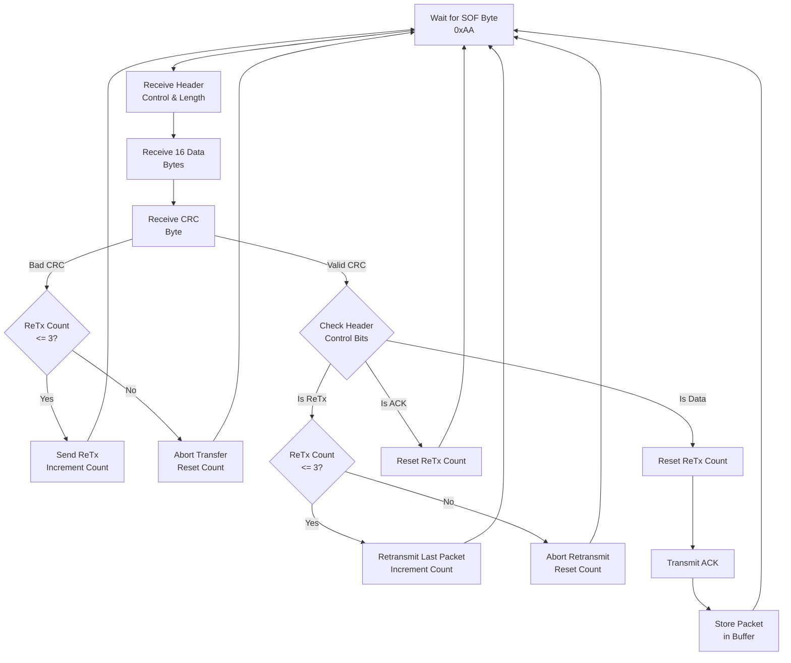
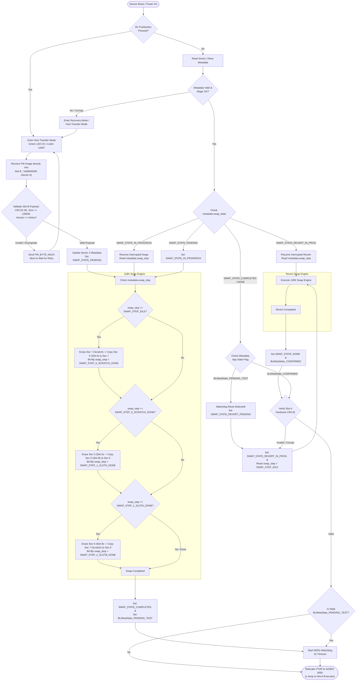

# Bootloader Documentation

- [How to Initiate a Transfer](#how-to-initiate-a-transfer)
- [Preliminary Information](#preliminary-information)
  - [Memory Map](#memory-map)
- [Target Firmware Requirements](#target-firmware-requirements)
  - [Linker Script (`.ld`) Configuration](#linker-script-ld-configuration)
  - [Binary File Output Format](#binary-file-output-format)
  - [Independent Watchdog (IWDG) Configuration](#independent-watchdog-iwdg-configuration)
  - [Firmware Info Section](#firmware-info-section)
  - [Word / Double-Word Alignment](#word--double-word-alignment)
- [Firmware Update Mechanism](#firmware-update-mechanism)
- [Protocol Specifications \& Definitions](#protocol-specifications--definitions)
  - [UART (Layer 0)](#uart-layer-0)
  - [Packet Transfer (Layer 1)](#packet-transfer-layer-1)
    - [Header Control Nibble Definitions](#header-control-nibble-definitions)
    - [Packet State Machine](#packet-state-machine)
  - [Firmware Transfer (Layer 2)](#firmware-transfer-layer-2)
    - [Firmware Protocol Sentinel Packet Values](#firmware-protocol-sentinel-packet-values)
    - [Firmware Protocol Constants](#firmware-protocol-constants)
    - [Firmware Protocol State Machine](#firmware-protocol-state-machine)
- [Firmware Integrity \& Rollback](#firmware-integrity--rollback)
  - [Flash Memory Layout](#flash-memory-layout)
  - [Bootloader Metadata Configuration](#bootloader-metadata-configuration)
  - [Downgrade Protection \& Validation Rules](#downgrade-protection--validation-rules)
  - [Swap-With-Scratch Engine](#swap-with-scratch-engine)
    - [Power-Loss Recovery](#power-loss-recovery)
  - [Application Confirmation (IWDG) \& Revert Flow](#application-confirmation-iwdg--revert-flow)
  - [Bootloader State Machine](#bootloader-state-machine)


## How to Initiate a Transfer

1. First, plug in the STM32F4 while holding down the blue pushbutton (B1). Instead of running the main firmware, this will power on the device in firmware transfer mode. The green LED should turn on, and the chip will idle.
2. Run the python script `firmware_transfer_host.py` with the desired bin file on the desired usb port. 
3. That's it!

Be sure that the binary file follows the specifications in [Target Firmware Requirements](#target-firmware-requirements).

## Preliminary Information

* **C Standard:** C99
* **Bootloader Size:** 32 KiB
* **Bootloader Start Addr:** `0x0800 0000`

### Memory Map

| Section                  | Description                                                       | Sector(s)      | Size  |
| ------------------------ | ----------------------------------------------------------------- | -------------- | ----- |
| Bootloader               | The bootloader handles firmware validation and upgrades.          | Sector 0 and 1 | 32KB  |
| Bootloader Metadata      | Stores persistent state about firmware upgrades and memory swaps  | Sector 2       | 16KB  |
| Active Firmware (Slot A) | Where the firmware is stored and executed from                    | Sector 5       | 128KB |
| Staging (Slot B)         | Where firmware is staged and verified before swapping to slot A   | Sector 6       | 128KB |
| Scratch Slot             | A scratch slot used for swapping slot A and slot B when necessary | Sector 7       | 128KB |

---

## Target Firmware Requirements

Application binaries uploaded via this bootloader must be specifically configured during compilation to run at the allocated offset.

### Linker Script (`.ld`) Configuration

* **Flash Origin:** Must be set to `0x0802 0000`.
* **Flash Size:** Maximum `128 KiB`.

Notice a `.firmware_info` section. This is expanded on more in [Firmware Info Section](#firmware-info-section).

```ld
MEMORY
{
  /* First 32 KiB reserved for bootloader */
  FLASH (rx)  : ORIGIN = 0x08020000, LENGTH = 128K
  RAM   (rwx) : ORIGIN = 0x20000000, LENGTH = 96K
}

SECTIONS
{
	.text : {
		*(.vectors)	/* Vector table */
		KEEP (*(.firmware_info))	/* Firmware specific info to store on device during transfer  */
		
        /* ... Rest of firmware ... */
    }
}

```

### Binary File Output Format

* The payload binary sent to the host flasher must be a raw binary
* File offset `0x0000 0000` in the `.bin` file must directly correspond to Flash address `0x08020 000`

### Independent Watchdog (IWDG) Configuration

Upon executing a newly swapped application image, the bootloader initializes the hardware (IWDG) with a 5-second timeout window prior to branching to firmware slot A.

Application Confirmation Requirement: The firmware must call `iwdg_ack()` every `IWDG_RECOMMENDED_ACK_INTERVAL_S` seconds to make sure the IWDG knows the program hasn't crashed.

Automatic Rollback Trigger: If the target application hangs, enters a deadlock, encounters a HardFault, or otherwise fails to acknowledge the IWDG before the 5-second timer expires, the IWDG triggers an MCU hardware reset. Upon reboot, the bootloader detects unconfirmed execution state and automatically triggers a rollback swap to restore the previous backup image.

### Firmware Info Section

After the vector table, the program must contain a `firmware_info_t` struct with certain fields set. This is then linked in the linker script as `.firmware_info`, and goes after the vector table. Some fields will be dynamically populated on transfer. Below is a table describing the struct. An example can be found in `firmware/src/info.c`.

All uninitialized fields must be set to padding bytes `0xFFFFFFFF`.

**NOTE:** To populate these fields properly (for transfer or to embed in the bootloader binary), you can use the `patch_firmware.py` script. The default firmware and transfer script automatically invoke this to populate the firmware info.

| Field             | Description                                                                                                                                                                                                                                                               | Must be populated in firmware?                                       |
| ----------------- | ------------------------------------------------------------------------------------------------------------------------------------------------------------------------------------------------------------------------------------------------------------------------- | -------------------------------------------------------------------- |
| sentinel          | A sentinel used internally to detect the structure prescence                                                                                                                                                                                                              | Yes. Must be 0xC0FFEE00                                              |
| device_id         | The device ID the firmware wishes to target                                                                                                                                                                                                                               | Yes. Must be the target device ID (Default for this purpose is 0x41) |
| version           | Version number of the firmware                                                                                                                                                                                                                                            | No                                                                   |
| length            | Length of the firmware minus the vector table and minus the firmware info                                                                                                                                                                                                 | No                                                                   |
| _reserved0        | Reserved for future use                                                                                                                                                                                                                                                   | No - Pad to 0xFFFFFFFF                                               |
| _reserved1        | Reserved for future use                                                                                                                                                                                                                                                   | No - Pad to 0xFFFFFFFF                                               |
| _reserved2        | Reserved for future use                                                                                                                                                                                                                                                   | No - Pad to 0xFFFFFFFF                                               |
| _reserved3        | Reserved for future use                                                                                                                                                                                                                                                   | No - Pad to 0xFFFFFFFF                                               |
| _reserved4        | Reserved for future use                                                                                                                                                                                                                                                   | No - Pad to 0xFFFFFFFF                                               |
| crc32             | A CRC32 value for an integrity check of the firmware. It is caculated with the bytes of the firmware image minus those in the vector table and minus those in the firmware info section. The CRC is calculated using the internal CRC peripheral of the STM32F401RE chip. | No                                                                   |
| `signature[2420]` | The MLDSA44 signature of the firmware image, starting from after the firmware info header. Right now the repository is configured to use the public private key pair found in the python CLI tool, and the key in `key.c`                                                 | No                                                                   |

### Word / Double-Word Alignment

Flash programming hardware requires writes to be word-aligned (32-bit or 64-bit depending on the target STM32 series). The host flasher and flash driver automatically pad the payload buffer to maintain proper word alignment prior to invoking `bl_flash_write()`.

---

## Firmware Update Mechanism

The system uses three protocol layers:

* **Layer 0:** UART Physical Transport
* **Layer 1:** Packet Transfer Protocol (Framing, CRC8, ReTx, Link-Layer ACKs)
* **Layer 2:** Firmware Transfer Protocol (Application-Layer Flow Control & Flash Programming)

---

## Protocol Specifications & Definitions

### UART (Layer 0)

The physical layer uses standard 8N1 asynchronous serial communication operating on STM32 **USART2**.

| Parameter    | Configuration                                                        |
| ------------ | -------------------------------------------------------------------- |
| Baud Rate    | 115200 bps                                                           |
| Data Bits    | 8                                                                    |
| Parity       | None                                                                 |
| Stop Bits    | 1                                                                    |
| Total Bits   | 10                                                                   |
| Flow Control | None                                                                 |
| Pin Mapping  | TX: PA2, RX: PA3 (Alternate Function AF7)                            |
| RX Mechanism | Interrupt-driven (`USART2_IRQ`) into a 128-byte software ring buffer |
| TX Mechanism | Polled / Blocking (`usart_send_blocking`)                            |

---

### Packet Transfer (Layer 1)

Packets are **19 bytes** total and sent over the UART stream using the following structure:

* **Byte 0:** Start of Frame (SOF) Sentinel (`0xAA`)
* **Byte 1:** Control & Length Header Byte
* **Bits [7:4] (Upper Nibble):** Control Flags
* **Bits [3:0] (Lower Nibble):** Payload Length minus 1 (`0x0` to `0xF` representing 1 to 16 bytes)


* **Bytes 2–17:** Data Payload (16 bytes, padded with `0xFF` if payload length is smaller)
* **Byte 18:** CRC8 (Calculated over Bytes 1–17: Header + Data)

#### Header Control Nibble Definitions

| Nibble Value | Flag   | Description                                              |
| ------------ | ------ | -------------------------------------------------------- |
| `0x00`       | `NONE` | Standard Data Packet                                     |
| `0x10`       | `ACK`  | Link-layer Acknowledge Packet (Confirms RX buffer entry) |
| `0x20`       | `ReTx` | Request Retransmit Packet                                |

#### Packet State Machine



---

### Firmware Transfer (Layer 2)

Layer 2 governs the application handshake, flash erasure, and data transfer.

- The sequence starts when a specific UART sequence is transmitted. Then, the protocol switches to using the packet protocol.
- The packet protocol is defined in the state machine in [Firmware Protocol State Machine](#firmware-protocol-state-machine)
- The sentinel values are sent as 1 byte packets, and whose values are defined in [Sentinel Packet Values](#firmware-protocol-sentinel-packet-values)

#### Firmware Protocol Sentinel Packet Values

| Macro Name                     | Hex Value | Total Payload Length | Bytes Following Sentinel           | Description                                                       |
| ------------------------------ | --------- | -------------------- | ---------------------------------- | ----------------------------------------------------------------- |
| `SYNC_SEQ_0`                   | `0xC1`    | 1 Byte               | None                               | Sync byte 0 sent by host                                          |
| `SYNC_SEQ_1`                   | `0xC3`    | 1 Byte               | None                               | Sync byte 1 sent by host                                          |
| `SYNC_SEQ_2`                   | `0xC5`    | 1 Byte               | None                               | Sync byte 2 sent by host                                          |
| `SYNC_SEQ_3`                   | `0xC7`    | 1 Byte               | None                               | Sync byte 3 sent by host                                          |
| `FW_BYTE_SEQ_OBSERVED`         | `0xA1`    | 1 Byte               | None                               | Target acknowledges valid sync sequence                           |
| `FW_BYTE_UPDATE_REQ`           | `0xA2`    | 1 Byte               | None                               | Host requests firmware update                                     |
| `FW_BYTE_UPDATE_RES`           | `0xA3`    | 1 Byte               | None                               | Target accepts firmware update request                            |
| `FW_BYTE_DEVICE_ID_REQ`        | `0xA4`    | 1 Byte               | None                               | Target requests device ID verification                            |
| `FW_BYTE_DEVICE_ID_RES`        | `0xA5`    | 2 Bytes              | 1 Byte (`uint8_t` Device ID)       | Host sends device ID (e.g., `0x14`)                               |
| `FW_BYTE_FW_LEN_REQ`           | `0xA6`    | 1 Byte               | None                               | Target requests firmware payload size                             |
| `FW_BYTE_FW_LEN_RES`           | `0xA7`    | 5 Bytes              | 4 Bytes (`uint32_t` Firmware Size) | Host sends total binary size in bytes                             |
| `FW_BYTE_READY`                | `0xA8`    | 1 Byte               | None                               | Target confirms chunk flash write complete (ready for next chunk) |
| `FW_BYTE_FW_UPDATE_SUCCESSFUL` | `0xA9`    | 1 Byte               | None                               | Target confirms entire image verified and written to flash        |
| `FW_BYTE_NACK`                 | `0xAB`    | 1 Byte               | None                               | Negative acknowledgment / general protocol error signal           |

#### Firmware Protocol Constants

The following are other important constants in relation to the firmware update mechanism

| Constant Name           | Value   | Description                                                                                                                  |
| ----------------------- | ------- | ---------------------------------------------------------------------------------------------------------------------------- |
| `FW_DEFAULT_TIMEOUT_MS` | `3000U` | The timeout in milliseconds of each transfer protocol wait state, with the exception of the sync state, which idles forever. |
| `FW_ERASE_TIMEOUT_S`    | `15U`   | The timeout in milliseconds of the host waiting for the flash to erase.                                                      |
| `DEVICE_ID`             | `0x14`  | This defines the target device you wish to update. For an STM32F4, this is the appropriate ID.                               |

#### Firmware Protocol State Machine


## Firmware Integrity & Rollback

The bootloader enforces an atomic, power-fail-safe **Swap-with-Scratch** pattern (modeled after MCUboot) to guarantee fail-safe firmware updates and execution.

Application execution always occurs out of **Slot A (Primary)** at physical origin `0x0802 0000` (Sector 5). **Slot B (Secondary)** at `0x0804 0000` (Sector 6) serves as the staging area for incoming image downloads over UART and holds the previous working backup after a swap. **Sector 7** (`0x0806 0000`) serves as a dedicated hardware scratch area during sector copy operations.

A dedicated **Boot Metadata Sector** (Sector 2) stores persistent state, image versions, and progress flags across reboots. To minimize flash wear and guarantee atomicity across unexpected power losses mid-swap, state transitions and progress markers utilize a zero-erase bit-flipping methodology.

Each firmware image contains a firmware info header containing version info, CRC32 integrity, as well as a MLDSA44 FIPS202 signature to prevent fraudulent images. If the integrity or signature check fails, automatic rollback is performed.

---

### Flash Memory Layout

The internal Flash memory of the STM32F401RE (512 KiB) is partitioned into symmetrical 128 KiB slots and dedicated boot/metadata sectors:

| Region / Sector                 | Flash Address Range           | Size    | Description                                            |
| ------------------------------- | ----------------------------- | ------- | ------------------------------------------------------ |
| **Bootloader** (Sectors 0–1)    | `0x0800 0000` – `0x0800 7FFF` | 32 KiB  | Immutable bootloader code                              |
| **Boot Metadata** (Sector 2)    | `0x0800 8000` – `0x0800 BFFF` | 16 KiB  | Non-volatile state, versions, CRC, and progress log    |
| **Reserved** (Sectors 3–4)      | `0x0800 C000` – `0x0801 FFFF` | 80 KiB  | Unused / Expansion space                               |
| **Slot A (Active)** (Sector 5)  | `0x0802 0000` – `0x0803 FFFF` | 128 KiB | Primary execution region (`ORIGIN = 0x08020000`)       |
| **Slot B (Staging)** (Sector 6) | `0x0804 0000` – `0x0805 FFFF` | 128 KiB | Staging region for incoming updates and backup storage |
| **Swap Scratch** (Sector 7)     | `0x0806 0000` – `0x0807 FFFF` | 128 KiB | Temporary staging area during sector swap execution    |

---

### Bootloader Metadata Configuration

A `boot_metadata_t` structure is located at address `0x0800 8000` in Flash Sector 2. Because NOR Flash memory bits can only transition from `1` to `0` without a sector erase, state flags and step progress transition strictly by clearing bits (`0xFF` $\rightarrow$ `0xFE` $\rightarrow$ `0xFC` $\rightarrow$ `0xF8`).

```c
typedef enum {
    SWAP_STATE_NONE           = 0xFFFFFFFF, /* Default state: No swap required / Idle */
    SWAP_STATE_PENDING        = 0xFFFFFFFE, /* Bit 0 cleared: Slot B verified; swap requested */
    SWAP_STATE_IN_PROGRESS    = 0xFFFFFFFC, /* Bit 1 cleared: 128K sector swap active */
    SWAP_STATE_COMPLETED      = 0xFFFFFFF8, /* Bit 2 cleared: Sector swap successfully finished */
    SWAP_STATE_REVERT_PENDING = 0xFFFFFFF0, /* Bit 3 cleared: App test failed; revert requested */
    SWAP_STATE_REVERT_IN_PROG = 0xFFFFFFE0  /* Bit 4 cleared: Revert swap active */
} swap_state_t;

typedef enum {
    SWAP_STEP_IDLE           = 0xFFFFFFFF, /* Default state: No steps completed */
    SWAP_STEP_0_SCRATCH_DONE = 0xFFFFFFFE, /* Bit 0 cleared: Slot A backed up to Scratch (Sec 7) */
    SWAP_STEP_1_SLOTA_DONE   = 0xFFFFFFFC, /* Bit 1 cleared: Slot B copied to Slot A (Sec 5) */
    SWAP_STEP_2_SLOTB_DONE   = 0xFFFFFFF8  /* Bit 2 cleared: Scratch copied to Slot B (Sec 6) */
} swap_step_t;

typedef struct {
    uint32_t sentinel;         /* Magic number (0x424F4F54 / "BOOT") */
    uint32_t active_version;   /* Version number currently running in Slot A */
    uint32_t staging_version;  /* Version number staged in Slot B */
    uint32_t swap_state;       /* Current swap state (SWAP_STATE_*) */
    uint32_t state;        /* Application test state (BLMetaState_PENDING_TEST or CONFIRMED) */
    uint32_t active_crc32;     /* Expected hardware CRC32 of Slot A image */
    uint32_t staging_crc32;    /* Hardware CRC32 of Slot B image */
    uint32_t swap_step;        /* Single-word progress tracker (SWAP_STEP_*) */
    uint32_t _reserved[6];
} boot_metadata_t;

```

---

### Downgrade Protection & Validation Rules

Before marking Slot B payload as valid and writing `SWAP_STATE_PENDING`, the bootloader verifies three validation constraints against the incoming payload:

* **CRC32 Integrity Check:** The calculated STM32 hardware CRC32 of the payload written to Slot B must match the expected checksum.
* **MLDSA44 Signature Check:** Verifies using the in-memory public key that the signature of the firmware image is valid. 
* **Downgrade Protection:** The incoming version (`staging_version`) must be strictly greater than or equal to `active_version`. Decrementing versions are rejected with `FW_BYTE_NACK`.
* **Slot Size Check:** Firmware length must not exceed 128 KiB (`0x0002 0000` bytes) to fit within Sector 5 limits.

---

### Swap-With-Scratch Engine

Because both Slot A (Sector 5) and Slot B (Sector 6) are 1:1 symmetrical 128 KiB sectors, the swap algorithm executes cleanly using full 128 KiB hardware sector erases with Sector 7 acting as the Scratch staging area:

```
[Slot A: Sector 5]  <--->  [Scratch: Sector 7]  <--->  [Slot B: Sector 6]

```

The `swap_state` variable is set to keep track of the progress of the swap in case of power failure.


#### Power-Loss Recovery

If power is lost during any step, the bootloader reboots, reads `swap_state == SWAP_STATE_IN_PROGRESS`, inspects `swap_step`, and resumes execution directly at the incomplete step without re-erasing or re-copying completed stages.

---

### Application Confirmation (IWDG) & Revert Flow

Upon firmware swap, the IWDG is initialized, the the firmware image must query it at a ~2s interval to ensure that the application has not hung.

To guard against software hangs, crashes, or hard faults in newly swapped applications:

1. Upon jumping to Slot A (`0x0802 0000`) in `BLMetaState_PENDING_TEST`, the bootloader initializes the IWDG with a **5-second timeout window**.
2. The firmware app must acknowledge the IWDG using `iwdg_ack()` every ~2s
3. Revert Sequence: If the application hangs or crashes before confirming, the IWDG forces a system reset. On reboot, the bootloader reads `BLMetaState_PENDING_TEST`, and re-executes the swap engine to exchange Sector 5 and Sector 6 back, restoring the known-good backup image.

---

### Bootloader State Machine

