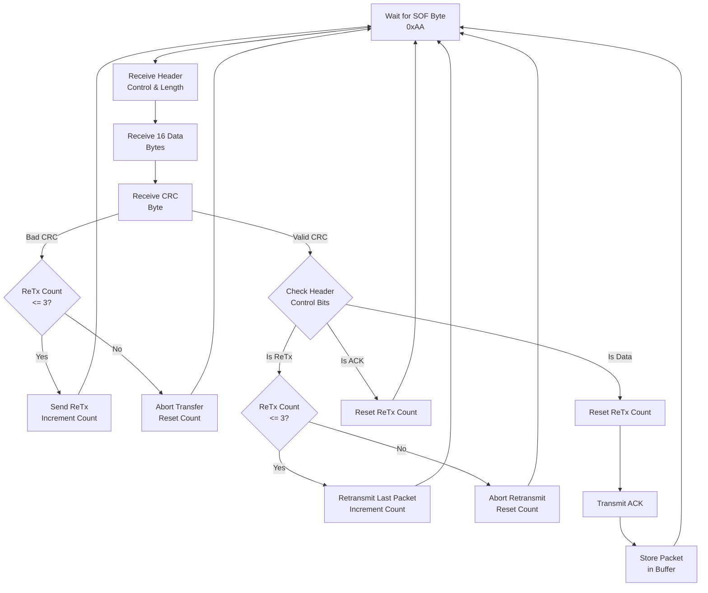
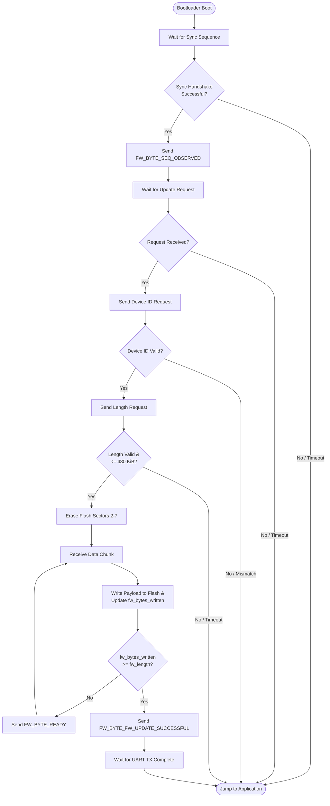
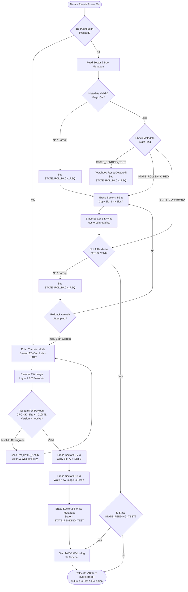

# Bootloader Documentation

- [How to Initiate a Transfer](#how-to-initiate-a-transfer)
- [Preliminary Information](#preliminary-information)
- [Target Firmware Requirements](#target-firmware-requirements)
  - [Linker Script (`.ld`) Configuration](#linker-script-ld-configuration)
  - [Binary File Output Format](#binary-file-output-format)
  - [Vector Table Relocation (`VTOR`)](#vector-table-relocation-vtor)
  - [Firmware Info Section](#firmware-info-section)
  - [Word / Double-Word Alignment](#word--double-word-alignment)
- [Firmware Update Mechanism](#firmware-update-mechanism)
- [Protocol Specifications \& Definitions](#protocol-specifications--definitions)
  - [UART (Layer 0)](#uart-layer-0)
  - [Packet Transfer (Layer 1)](#packet-transfer-layer-1)
    - [Header Control Nibble Definitions](#header-control-nibble-definitions)
    - [Packet State Machine](#packet-state-machine)
  - [Firmware Transfer (Layer 2)](#firmware-transfer-layer-2)
    - [Firmware Protocol Sentinel Packet Values](#firmware-protocol-sentinel-packet-values)
    - [Firmware Protocol Constants](#firmware-protocol-constants)
    - [Firmware Protocol State Machine](#firmware-protocol-state-machine)
- [Firmware Integrity](#firmware-integrity)


## How to Initiate a Transfer

1. First, plug in the STM32F4 while holding down the blue pushbutton (B1). Instead of running the main firmware, this will power on the device in firmware transfer mode. The green LED should turn on, and the chip will idle.
2. Run the python script `firmware_transfer_host.py` with the desired bin file on the desired usb port. 
3. That's it!

Be sure that the binary file follows the specifications in [Target Firmware Requirements](#target-firmware-requirements).

## Preliminary Information

* **C Standard:** C99
* **Bootloader Size:** 32 KiB
* **Bootloader Start Addr:** `0x0800 0000`
* **Bootloader End Addr:** `0x0800 7FFF`

The bootloader resides in the first two sectors of flash memory (`0x0800 0000` – `0x0800 7FFF`). The application firmware resides in sectors 2–7 from addresses `0x0800 8000` to `0x0807 FFFF`.

---

## Target Firmware Requirements

Application binaries uploaded via this bootloader must be specifically configured during compilation to run at the allocated offset.

### Linker Script (`.ld`) Configuration

* **Flash Origin:** Must be set to `0x0800 8000`.
* **Flash Size:** Maximum `480 KiB` (`0x0007 8000` bytes).

Notice a `.firmware_info` section. This is expanded on more in [Firmware Info Section](#firmware-info-section).

```ld
MEMORY
{
  /* First 32 KiB reserved for bootloader */
  FLASH (rx)  : ORIGIN = 0x08008000, LENGTH = 480K
  RAM   (rwx) : ORIGIN = 0x20000000, LENGTH = 128K
}

SECTIONS
{
	.text : {
		*(.vectors)	/* Vector table */
		KEEP (*(.firmware_info))	/* Firmware specific info to store on device during transfer  */
		
        /* ... Rest of firmware ... */
    }
}

```

### Binary File Output Format

* The payload binary sent to the host flasher must be a raw binary
* File offset `0x00000000` in the `.bin` file must directly correspond to Flash address `0x08008000`

### Vector Table Relocation (`VTOR`)

C startup might reset SCB_VTOR, so the `main` function must relocate it to its vector table. For example, using `libopencm3`


```c
#include <libopencm3/stm32/memorymap.h>

#define BOOTLOADER_SIZE (0x8000U)
#define FIRMWARE_START_ADDR (FLASH_BASE + BOOTLOADER_SIZE)

int main(void) {
    SCB_VTOR = FIRMWARE_START_ADDR;
    // ... Rest of the application
}

```

### Firmware Info Section

After the vector table, the program must contain a `firmware_info_t` struct with certain fields set. This is then linked in the linker script as `.firmware_info`, and goes after the vector table. Some fields will be dynamically populated on transfer. Below is a table describing the struct. An example can be found in `firmware/src/info.c`.

All uninitialized fields must be set to padding bytes `0xFFFFFFFF`.

| Field      | Description                                                                                                                                                                                                                                                               | Must be populated in firmware?                                       |
| ---------- | ------------------------------------------------------------------------------------------------------------------------------------------------------------------------------------------------------------------------------------------------------------------------- | -------------------------------------------------------------------- |
| sentinel   | A sentinel used internally to detect the structure prescence                                                                                                                                                                                                              | Yes. Must be 0xC0FFEE00                                              |
| device_id  | The device ID the firmware wishes to target                                                                                                                                                                                                                               | Yes. Must be the target device ID (Default for this purpose is 0x41) |
| version    | Version number of the firmware                                                                                                                                                                                                                                            | No                                                                   |
| length     | Length of the firmware minus the vector table and minus the firmware info                                                                                                                                                                                                 | No                                                                   |
| _reserved0 | Reserved for future use                                                                                                                                                                                                                                                   | No - Pad to 0xFFFFFFFF                                               |
| _reserved1 | Reserved for future use                                                                                                                                                                                                                                                   | No - Pad to 0xFFFFFFFF                                               |
| _reserved2 | Reserved for future use                                                                                                                                                                                                                                                   | No - Pad to 0xFFFFFFFF                                               |
| _reserved3 | Reserved for future use                                                                                                                                                                                                                                                   | No - Pad to 0xFFFFFFFF                                               |
| _reserved4 | Reserved for future use                                                                                                                                                                                                                                                   | No - Pad to 0xFFFFFFFF                                               |
| crc32      | A CRC32 value for an integrity check of the firmware. It is caculated with the bytes of the firmware image minus those in the vector table and minus those in the firmware info section. The CRC is calculated using the internal CRC peripheral of the STM32F401RE chip. | No                                                                   |

### Word / Double-Word Alignment

Flash programming hardware requires writes to be word-aligned (32-bit or 64-bit depending on the target STM32 series). The host flasher and flash driver automatically pad the payload buffer to maintain proper word alignment prior to invoking `bl_flash_write()`.

---

## Firmware Update Mechanism

The system uses three protocol layers:

* **Layer 0:** UART Physical Transport
* **Layer 1:** Packet Transfer Protocol (Framing, CRC8, ReTx, Link-Layer ACKs)
* **Layer 2:** Firmware Transfer Protocol (Application-Layer Flow Control & Flash Programming)

---

## Protocol Specifications & Definitions

### UART (Layer 0)

The physical layer uses standard 8N1 asynchronous serial communication operating on STM32 **USART2**.

| Parameter    | Configuration                                                        |
| ------------ | -------------------------------------------------------------------- |
| Baud Rate    | 115200 bps                                                           |
| Data Bits    | 8                                                                    |
| Parity       | None                                                                 |
| Stop Bits    | 1                                                                    |
| Total Bits   | 10                                                                   |
| Flow Control | None                                                                 |
| Pin Mapping  | TX: PA2, RX: PA3 (Alternate Function AF7)                            |
| RX Mechanism | Interrupt-driven (`USART2_IRQ`) into a 128-byte software ring buffer |
| TX Mechanism | Polled / Blocking (`usart_send_blocking`)                            |

---

### Packet Transfer (Layer 1)

Packets are **19 bytes** total and sent over the UART stream using the following structure:

* **Byte 0:** Start of Frame (SOF) Sentinel (`0xAA`)
* **Byte 1:** Control & Length Header Byte
* **Bits [7:4] (Upper Nibble):** Control Flags
* **Bits [3:0] (Lower Nibble):** Payload Length minus 1 (`0x0` to `0xF` representing 1 to 16 bytes)


* **Bytes 2–17:** Data Payload (16 bytes, padded with `0xFF` if payload length is smaller)
* **Byte 18:** CRC8 (Calculated over Bytes 1–17: Header + Data)

#### Header Control Nibble Definitions

| Nibble Value | Flag   | Description                                              |
| ------------ | ------ | -------------------------------------------------------- |
| `0x00`       | `NONE` | Standard Data Packet                                     |
| `0x10`       | `ACK`  | Link-layer Acknowledge Packet (Confirms RX buffer entry) |
| `0x20`       | `ReTx` | Request Retransmit Packet                                |

#### Packet State Machine



---

### Firmware Transfer (Layer 2)

Layer 2 governs the application handshake, flash erasure, and data transfer.

- The sequence starts when a specific UART sequence is transmitted. Then, the protocol switches to using the packet protocol.
- The packet protocol is defined in the state machine in [Firmware Protocol State Machine](#firmware-protocol-state-machine)
- The sentinel values are sent as 1 byte packets, and whose values are defined in [Sentinel Packet Values](#firmware-protocol-sentinel-packet-values)

#### Firmware Protocol Sentinel Packet Values

| Macro Name                     | Hex Value | Total Payload Length | Bytes Following Sentinel           | Description                                                       |
| ------------------------------ | --------- | -------------------- | ---------------------------------- | ----------------------------------------------------------------- |
| `SYNC_SEQ_0`                   | `0xC1`    | 1 Byte               | None                               | Sync byte 0 sent by host                                          |
| `SYNC_SEQ_1`                   | `0xC3`    | 1 Byte               | None                               | Sync byte 1 sent by host                                          |
| `SYNC_SEQ_2`                   | `0xC5`    | 1 Byte               | None                               | Sync byte 2 sent by host                                          |
| `SYNC_SEQ_3`                   | `0xC7`    | 1 Byte               | None                               | Sync byte 3 sent by host                                          |
| `FW_BYTE_SEQ_OBSERVED`         | `0xA1`    | 1 Byte               | None                               | Target acknowledges valid sync sequence                           |
| `FW_BYTE_UPDATE_REQ`           | `0xA2`    | 1 Byte               | None                               | Host requests firmware update                                     |
| `FW_BYTE_UPDATE_RES`           | `0xA3`    | 1 Byte               | None                               | Target accepts firmware update request                            |
| `FW_BYTE_DEVICE_ID_REQ`        | `0xA4`    | 1 Byte               | None                               | Target requests device ID verification                            |
| `FW_BYTE_DEVICE_ID_RES`        | `0xA5`    | 2 Bytes              | 1 Byte (`uint8_t` Device ID)       | Host sends device ID (e.g., `0x14`)                               |
| `FW_BYTE_FW_LEN_REQ`           | `0xA6`    | 1 Byte               | None                               | Target requests firmware payload size                             |
| `FW_BYTE_FW_LEN_RES`           | `0xA7`    | 5 Bytes              | 4 Bytes (`uint32_t` Firmware Size) | Host sends total binary size in bytes                             |
| `FW_BYTE_READY`                | `0xA8`    | 1 Byte               | None                               | Target confirms chunk flash write complete (ready for next chunk) |
| `FW_BYTE_FW_UPDATE_SUCCESSFUL` | `0xA9`    | 1 Byte               | None                               | Target confirms entire image verified and written to flash        |
| `FW_BYTE_NACK`                 | `0xAB`    | 1 Byte               | None                               | Negative acknowledgment / general protocol error signal           |

#### Firmware Protocol Constants

The following are other important constants in relation to the firmware update mechanism

| Constant Name           | Value   | Description                                                                                                                  |
| ----------------------- | ------- | ---------------------------------------------------------------------------------------------------------------------------- |
| `FW_DEFAULT_TIMEOUT_MS` | `3000U` | The timeout in milliseconds of each transfer protocol wait state, with the exception of the sync state, which idles forever. |
| `FW_ERASE_TIMEOUT_S`    | `15U`   | The timeout in milliseconds of the host waiting for the flash to erase.                                                      |
| `DEVICE_ID`             | `0x14`  | This defines the target device you wish to update. For an STM32F4, this is the appropriate ID.                               |

#### Firmware Protocol State Machine



## Firmware Integrity

Multiple layers of error detection are performed in the packet and firmware transfer protocols. However, as a final check, the CRC32 of the firmware image (minus the vector table and minus the firmware info sections) is calculated upon transfer, and stored in the device in the firmware info section (See [Firmware Info Section](#firmware-info-section)). Upon boot, the bootloader will check the integrity of the image and only boot if the CRC32 matches.

## Firmware Integrity & Rollback

The bootloader enforces an A/B Swap & Rollback pattern to ensure fail-safe execution. All execution occurs out of Slot A (Primary) at physical origin `0x0800 C000`. Slot B (Backup) serves as a staging area and rollback restore source.

A dedicated Boot Metadata Sector (Flash Sector 2) stores persistent state across reboots. To minimize flash wear, state transitions utilize a zero-erase bit-flipping methodology.

### Flash Memory Layout

| Region / Sector                   | Flash Address Range           | Size    | Description                                        |
| --------------------------------- | ----------------------------- | ------- | -------------------------------------------------- |
| **Bootloader** (Sectors 0–1)      | `0x0800 0000` – `0x0800 7FFF` | 32 KiB  | Immutable bootloader code                          |
| **Boot Metadata** (Sector 2)      | `0x0800 8000` – `0x0800 BFFF` | 16 KiB  | Non-volatile state, versions, and validation flags |
| **Slot A (Active)** (Sectors 3–5) | `0x0800 C000` – `0x0803 FFFF` | 212 KiB | Execution region (`ORIGIN = 0x0800C000`)           |
| **Slot B (Backup)** (Sectors 6–7) | `0x0804 0000` – `0x0807 FFFF` | 256 KiB | Backup / Staging region                            |

---

### Bootloader Metadata Configuration

A `boot_metadata_t` structure is stored at offset `0x0800 8000` in Flash Sector 2. Because flash memory can only be flipped from `1` to `0` without an erase, the `state` field is designed as a 32-bit word that transitions by clearing bits.

| Field            | Type       | Description                                                     |
| ---------------- | ---------- | --------------------------------------------------------------- |
| `sentinel`       | `uint32_t` | Magic number (`0x424F4F54` / `"BOOT"`) verifying valid metadata |
| `state`          | `uint32_t` | Current boot state (transitions via zero-erase bit-flipping)    |
| `active_version` | `uint32_t` | Version number currently running in Slot A                      |
| `backup_version` | `uint32_t` | Version number backed up in Slot B                              |
| `crc32`          | `uint32_t` | CRC32 calculated over the struct (excluding the `state` field)  |

#### Bit-Flipping State Flags

Using 32-bit word programming (`bl_flash_write`), the states transition strictly downward. Sector 2 is only erased when a new firmware transfer occurs, never during normal boot or application confirmation.

| Hex Value    | State Flag           | Description                                                        |
| ------------ | -------------------- | ------------------------------------------------------------------ |
| `0xFFFFFFFF` | `STATE_ERASED`       | Default state after a sector erase                                 |
| `0xFFFFFFFE` | `STATE_PENDING_TEST` | Flips Bit 0. Written by bootloader prior to testing a new update   |
| `0xFFFFFFFC` | `STATE_CONFIRMED`    | Flips Bit 1. Written by application to verify successful execution |
| `0x00000000` | `STATE_ROLLBACK_REQ` | Flips all bits. Triggers restore from Slot B on the next boot      |

---

### Downgrade Protection & Validation Rules

Before initiating an update or swapping images, the bootloader validates three constraints against the incoming `firmware_info_t` struct:

* **CRC32 Integrity Check:** The calculated STM32 hardware CRC32 of the firmware image payload (excluding vector table and info section) must match `firmware_info_t.crc32`.
* **Downgrade Protection:** The incoming version (`firmware_info_t.version`) must be greater than or equal to `metadata.active_version`. Decrementing versions are rejected (`FW_BYTE_NACK`).
* **Slot Size Check:** Firmware length must not exceed 212 KiB (`0x0003 4000` bytes) to ensure it fits within Slot A.

---

### Application Confirmation (IWDG)

To protect against system hangs or hard faults in newly flashed application firmware, an Independent Watchdog (IWDG) confirmation sequence is required:

1. Upon jumping to Slot A in `STATE_PENDING_TEST`, the bootloader enables the IWDG with a 5-second timeout window.
2. The main application must initialize core peripherals and invoke a confirmation routine (e.g., `bootloader_confirm_app()`) before the IWDG expires.
3. This routine writes `0xFFFFFFFC` (`STATE_CONFIRMED`) directly to the `state` memory address in Sector 2 (no erase performed) and begins feeding the watchdog.
4. If the application crashes or hangs before confirming, the IWDG hardware forces a system reset. On reboot, the bootloader reads `STATE_PENDING_TEST`, directly overwrites the state to `0x00000000` (`STATE_ROLLBACK_REQ`), and initiates an automatic rollback.

---

### Bootloader State Machine



