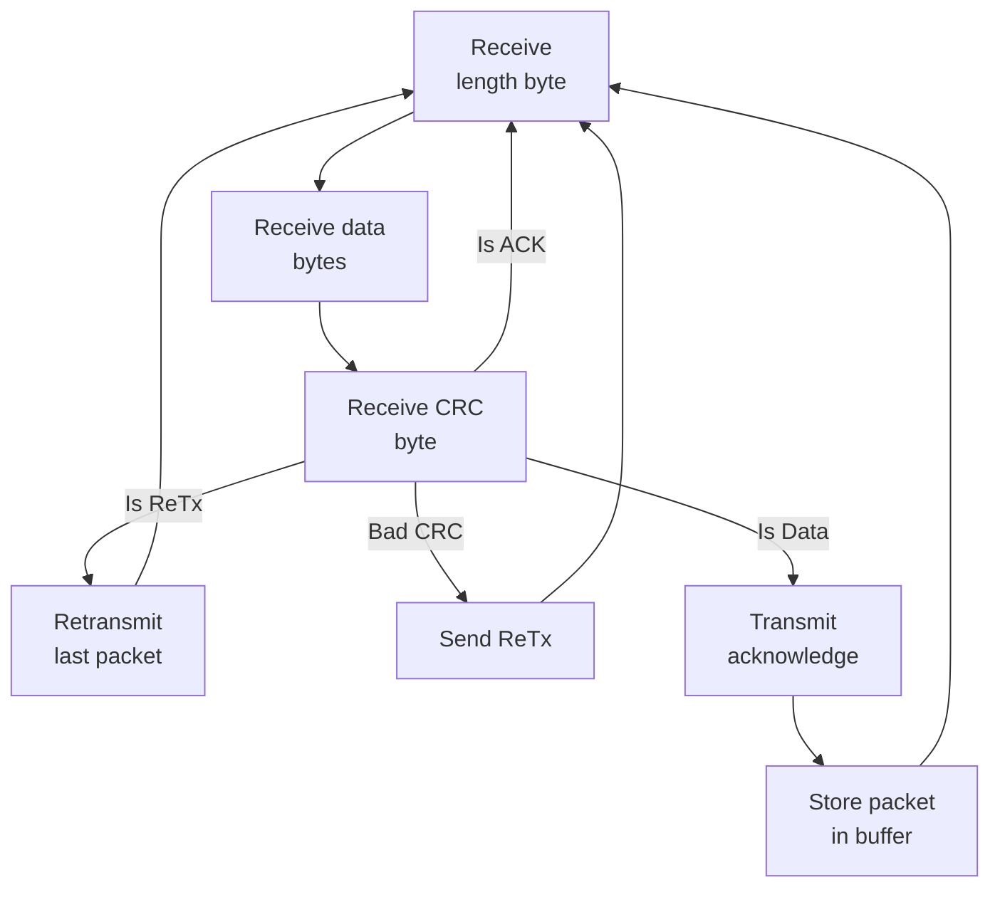
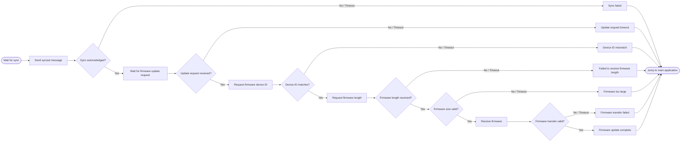

Here is your updated Markdown document with the **UART** section filled out to accurately document your peripheral setup:

# Bootloader Documentation

## Preliminary Information

* C Standard: C99
* Size: 32KiB
* Start Addr: `0x0800 0000`
* End Addr: `0x0800 7FFF`

The bootloader lives in the first two sectors of flash memory. The firmware lives in sectors (2 - 7) from addresses `0x0800 8000` - `0x0807 FFFF`.

## Firmware Update Mechanism

The following protocol layers are used. Custom protocols are elaborated in [Custom Protocols](https://www.google.com/search?q=%2523custom-protocols&utm_source=gemini)

* Layer 0: UART
* Layer 1: [Packet Transfer](https://www.google.com/search?q=%2523packet-transfer&utm_source=gemini)
* Layer 2: [Firmware Transfer](https://www.google.com/search?q=%2523firmware-transfer&utm_source=gemini)

## Protocol Specifications & Definitions

### UART

The physical layer uses standard 8N1 asynchronous serial communication operating on STM32 **USART2**.

| Parameter | Configuration |
| --- | --- |
| Baud Rate | 115200 bps |
| Data Bits | 8 |
| Parity | None |
| Stop Bits | 1 |
| Total Bits | 10 |
| Flow Control | None |
| Pin Mapping | TX: PA2, RX: PA3 (Alternate Function AF7) |
| RX Mechanism | Interrupt-driven (`USART2_IRQ`) into a 128-byte software ring buffer |
| TX Mechanism | Polled / Blocking (`usart_send_blocking`) |

### Packet Transfer

Packets are

* 18 bytes
* Byte 0: Length OR Special Packet Sentinel
* Bytes 1-16: Data
* Byte 17: CRC8

Special Packets/Bytes:

| Byte | Value | Description |
| --- | --- | --- |
| 1 | `0x15` | ACK - Acknowledge |
| 1 | `0x19` | ReTx - Request Retransmit |
| Data Bytes | `0xFF` | Padding - Must be used when data is not meant to occupy data slots |

The following state machine diagram represents the protocol used to transfer packets of data over UART

### Firmware Transfer

The following state machine diagram represents the protocol for the user and hardware initiating a firmware transfer and update.

