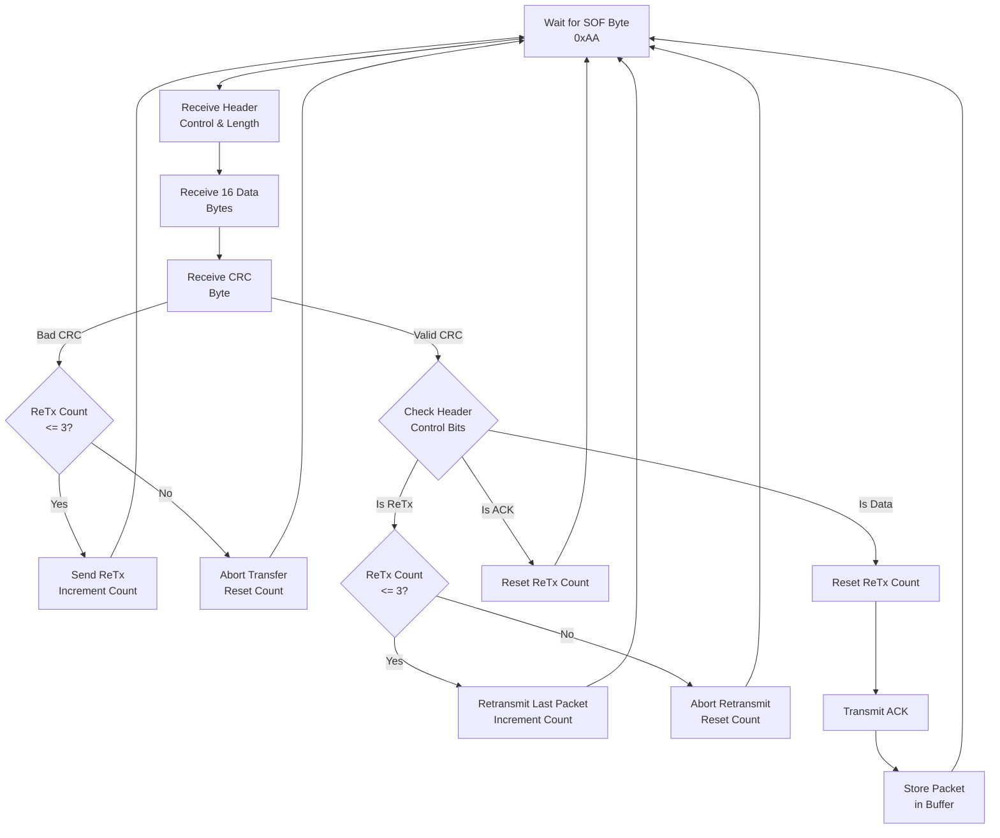

Here is your updated Markdown document with the **UART** section filled out to accurately document your peripheral setup:

# Bootloader Documentation

## Preliminary Information

* C Standard: C99
* Size: 32KiB
* Start Addr: `0x0800 0000`
* End Addr: `0x0800 7FFF`

The bootloader lives in the first two sectors of flash memory. The firmware lives in sectors (2 - 7) from addresses `0x0800 8000` - `0x0807 FFFF`.

## Firmware Update Mechanism

The following protocol layers are used. Custom protocols are elaborated in [Custom Protocols](https://www.google.com/search?q=%2523custom-protocols&utm_source=gemini)

* Layer 0: UART
* Layer 1: [Packet Transfer](https://www.google.com/search?q=%2523packet-transfer&utm_source=gemini)
* Layer 2: [Firmware Transfer](https://www.google.com/search?q=%2523firmware-transfer&utm_source=gemini)

## Protocol Specifications & Definitions

### UART

The physical layer uses standard 8N1 asynchronous serial communication operating on STM32 **USART2**.

| Parameter | Configuration |
| --- | --- |
| Baud Rate | 115200 bps |
| Data Bits | 8 |
| Parity | None |
| Stop Bits | 1 |
| Total Bits | 10 |
| Flow Control | None |
| Pin Mapping | TX: PA2, RX: PA3 (Alternate Function AF7) |
| RX Mechanism | Interrupt-driven (`USART2_IRQ`) into a 128-byte software ring buffer |
| TX Mechanism | Polled / Blocking (`usart_send_blocking`) |

### Packet Transfer

Packets are **19 bytes** total and sent over the UART stream using the following structure:

* **Byte 0:** Start of Frame (SOF) Sentinel (`0xAA`)
* **Byte 1:** Control & Length Header Byte
    * **Bits [7:4] (Upper Nibble):** Control Flags
    * **Bits [3:0] (Lower Nibble):** Payload Length minus 1 (`0x0` to `0xF` representing 1 to 16 bytes)

* **Bytes 2–17:** Data Payload (16 bytes, padded with `0xFF` if payload length is smaller)
* **Byte 18:** CRC8 (Calculated over Bytes 1–17: Header + Data)

#### Header Control Nibble Definitions

| Nibble Value | Flag | Description |
| --- | --- | --- |
| `0x00` | NONE | Standard Data Packet |
| `0x10` | ACK | Acknowledge Packet |
| `0x20` | ReTx | Request Retransmit Packet |

#### Constants & Parameters

| Byte / Parameter | Value | Description |
| --- | --- | --- |
| `SOF` | `0xAA` | Start of Frame Sync Marker |
| Data Bytes Padding | `0xFF` | Padding used to fill unused slots in the 16-byte data buffer |
| Max ReTx Attempts | `3` | Maximum consecutive retransmit attempts allowed before aborting |

#### Protocol State Machine

The following state machine diagram represents the frame synchronization and processing pipeline used over UART:

### Firmware Transfer

The following state machine diagram represents the protocol for the user and hardware initiating a firmware transfer and update.

