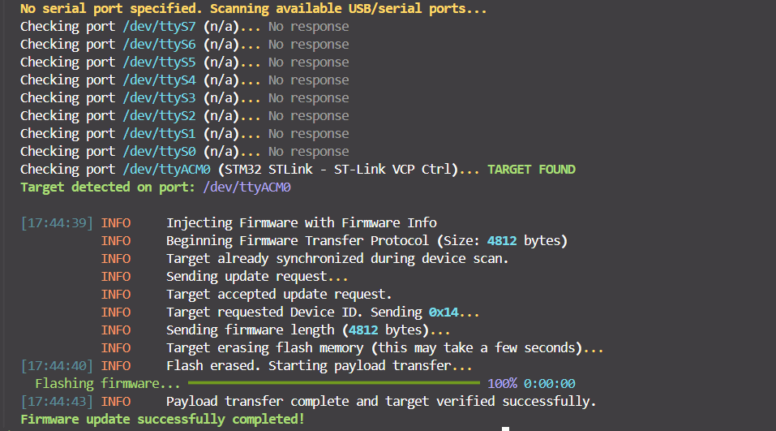

# STM32F401RE Bootloader



An asynchronous, fail-safe bootloader built from scratch for the STM32F401RE (ARM Cortex-M4).

I built this project to dive deep into bare-metal embedded systems, memory-mapped flash operations, and fault-tolerant firmware updates. It features an MCUboot-inspired A/B swap mechanism, a 3-layer UART protocol with packet framing, and post-quantum cryptographic image signing.

> **Full Specification & Protocol Docs:** For detailed memory layouts, state machine diagrams, and firmware requirements, check out [`DOCS.md`](DOCS.md).

> **NOTE:** This is an educational project, and should not be used in production. While security measures are implemented, they are not production grade. Particularly, signatures would require a public key burned in OTP memory, and a securely stored private key. 

## Technical Highlights

### Fail-Safe & Power-Loss Recovery Engine

* **A/B Staging Layout:** Dual 128 KiB memory slots (Slot A at `0x08020000` for active execution, Slot B at `0x08040000` for staging) paired with a dedicated hardware scratch sector (`0x08060000`).
* **Atomic Swap-with-Scratch Engine:** Updates are staged and verified in Slot B before being swapped into Slot A sector-by-sector using the scratch region.
* **Power-Fail Resilient State Tracking:** State flags and step progress log to a persistent metadata sector using bit-flipping (`0xFF` $\rightarrow$ `0xFE` $\rightarrow$ `0xFC` ...). If power dies mid-copy, the bootloader resumes execution at the exact incomplete step on the next boot without corrupting memory or re-erasing progress.
* **IWDG Automatic Rollback:** Upon swapping to a new image, the Independent Watchdog initializes with a 5-second window. If new firmware hangs, deadlocks, or crashes without calling `iwdg_ack()`, the watchdog forces a reset, and the bootloader reverts Slot A back to the previous known-good image.

### Post-Quantum Security & Integrity

* **MLDSA44 (Dilithium) Signing:** Integrates post-quantum asymmetric signatures (FIPS 202) alongside STM32 hardware CRC32 checks. Unsigned, corrupted, or tampered images are rejected at the staging boundary before flashing.
* **Downgrade Protection:** Rejects incoming images if their target version is lower than the active running version in Slot A.

### Robust 3-Layer Communications Protocol

* **Layer 0 (Physical/Driver):** Interrupt-driven `USART2_IRQ` paired with a custom lock-free ring buffer for byte reception, preventing dropped bytes during flash programming operations.
* **Layer 1 (Packet Transport):** Fixed 19-byte packets framed with a `0xAA` Start-of-Frame (SOF) sentinel, control flags, length headers, a 16-byte payload, and a CRC8 byte. Includes an automatic link-layer retransmission (ReTx) loop to handle noisy lines.
* **Layer 2 (Firmware Application Protocol):** A state machine governing multi-byte sync sequences, device ID handshakes, chunked payload streaming, and flow control.

---

## Quick Start

### Prerequisites

* **Toolchain:** `arm-none-eabi-gcc`, `make`
* **Flashing Tools:** `stlink-tools` (`st-flash`)
* **Host Runtime:** Python 3
* **Drivers:** ST-Link USB Drivers

If you are on Windows, using **WSL2** is recommended.

### Building & Flashing

1. Clone the repository and submodules:
```bash
git clone --recursive https://github.com/logandarby/stm32f4-bootloader.git
cd stm32f4-bootloader
git submodule update --init --recursive
```


2. Build the bootloader binary:
```bash
cd bootloader
make
```


3. Flash the bootloader to Sector 0 (`0x08000000`):
```bash
st-flash --reset write bootloader.bin 0x08000000
```

### Debugging with Cortex-Debug and VSCode

This project is pre-configured to offer an ultra-easy flashing and debugging expeience with the `cortex-debug` extension using vscode. For the easiest flashing/debugging experience, it's recommended these IDEs and extensions are used.


---

## Initiating a Firmware Update

1. Hold down the **Blue Pushbutton (B1)** on the NUCLEO-F401RE board and plug in the USB cable (or hit reset).
2. The onboard **Green LED** turns on, indicating the chip is idling in bootloader host transfer mode.
3. Run the host Python flasher:
```bash
cd scripts
# Optionally create a virtual environment
#---
python3 -m venv .venv
source .venv/bin/activate
# ---
python -m pip install -r requirements.txt
python firmware_transfer_host.py ../default-firmware/default-firmware.bin
```

## Making Custom Firmware

To comply with the firmware requirements for this bootloader, it's recommended you copy the source code in `default-firmware/` including the linkerscript, and the relevant files from `common/`.

The documentation for firmware requirements is available in the `Firmware Requirements` section in [DOCS.md](DOCS.md).


---

## Using WSL2 with ST-Link

To attach your NUCLEO board's ST-Link interface to WSL, run the following in PowerShell as Administrator:

```powershell
# Install usbipd-win (one-time setup)
winget install --interactive --exact dorssel.usbipd-win

# List USB devices and note the BUS ID for ST-Link
usbipd list

# Bind and attach the ST-Link device to WSL
usbipd bind -b <BUS_ID>
usbipd attach --wsl -ab <BUS_ID>

```
